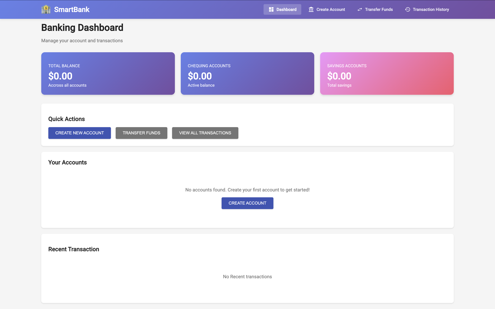
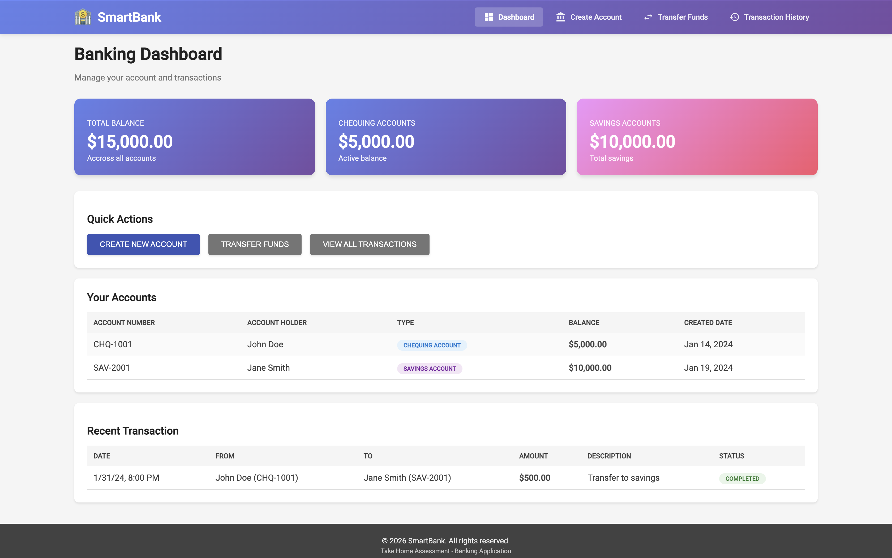
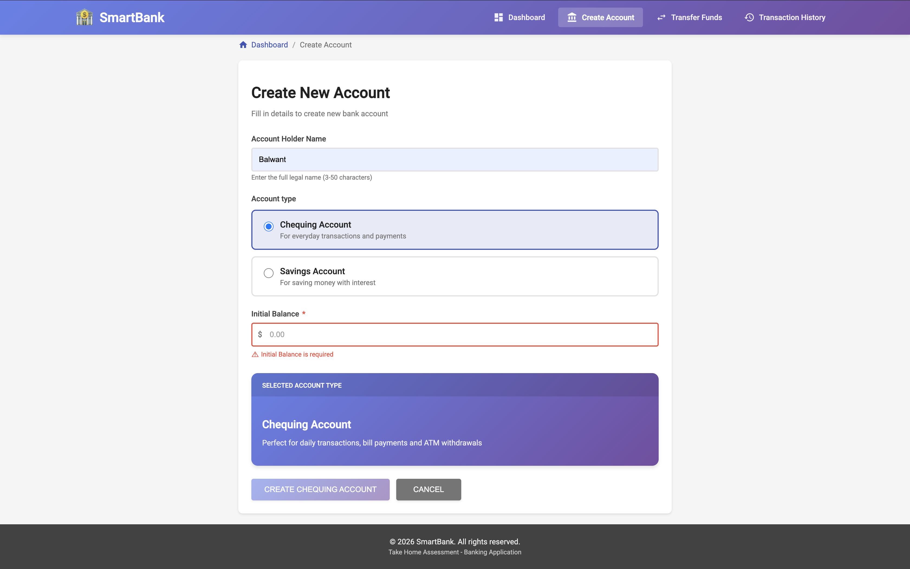
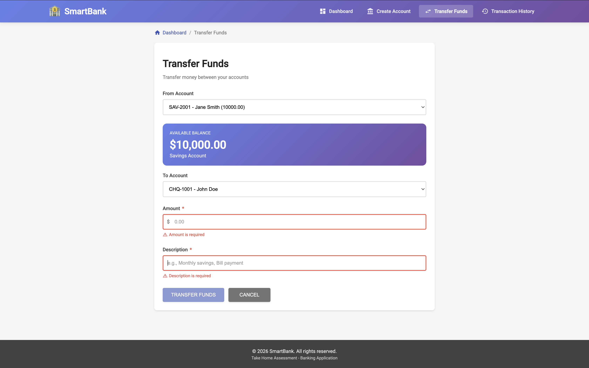
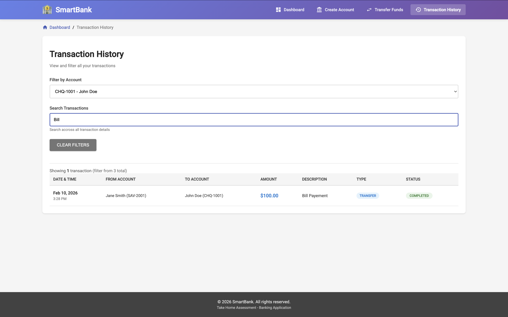
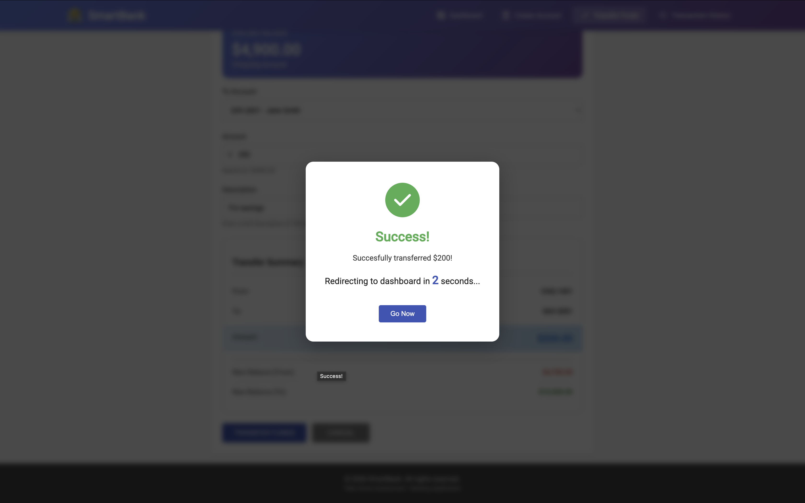
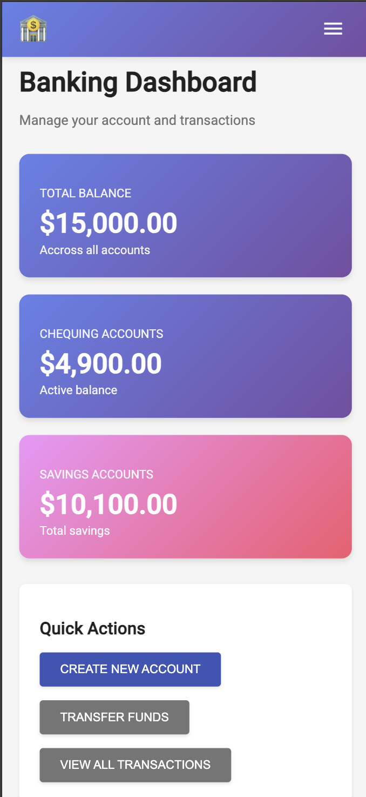
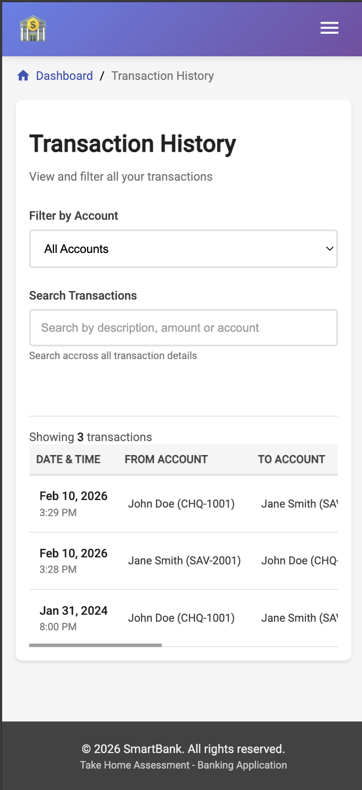

# SmartBank - Banking Transactions Web Application

A simple, user-friendly banking application built with Angular that allows users to manage multiple accounts and transfer funds between them.

---

## Table of Contents

- [Overview](#overview)
- [Screenshots](#screenshots)
- [Architecture & Design](#architecture--design)
- [Features](#features)
- [Technology Stack](#technology-stack)
- [Prerequisites](#prerequisites)
- [Installation & Setup](#installation--setup)
- [Running the Application](#running-the-application)
- [Project Structure](#project-structure)
- [How It Works](#how-it-works)
- [Key Components](#key-components)
- [Accessibility Features](#accessibility-features)
- [Testing the Application](#testing-the-application)
- [Quick Start Summary](#quick-start-summary)
---

## Overview

SmartBank is a front-end banking application that demonstrates modern Angular development practices. Users can:
- Create multiple bank accounts (Chequing or Savings)
- Transfer money between accounts
- View transaction history with filters
- See real-time balance updates

All data is stored locally in the browser using **localStorage**, so no backend server is required.

---

## Screenshots

### Dashboard
#### Account Overview with no accounts

*Main dashboard showing account statistics, quick actions, and recent transactions when there are no accounts*

#### Account Overview with accounts

*Main dashboard showing account statistics, quick actions, and recent transactions*

#### Account Overview with accounts more than 5

*Main dashboard where we have more than 5 accounts and account list colapse down to show only 5 so we don't have a messy dashboard and a button or link can be used by a user to see all accounts*

---

### Create Account

*Form with validation, account type selection (Chequing/Savings), and conditional button styling*

---

### Fund Transfer

*Transfer interface with real-time balance display and transfer summary preview*

---

### Transaction History

*Filterable transaction table with search functionality and account filters*

---

### Success Modal

*Loading overlay with countdown timer and auto-redirect functionality*

---

### Mobile Responsive Design
<p float="left">
  
  
  
</p>

---

## Architecture & Design

<details>
<summary><b>Click to view System Architecture Diagram</b></summary>


</details>

<details>
<summary><b>Click to view Component Structure Diagram</b></summary>


</details>

---
## Features

### Core Functionality
- **Account Creation** - Create accounts with initial balance and account type selection
- **Fund Transfers** - Transfer money between accounts with validation
- **Transaction History** - View all transactions with search and filter options
- **Dashboard** - Overview of all accounts and recent transactions

### Advanced Features
- **Conditional Styling** - Buttons change color based on account type (Chequing = Purple, Savings = Pink)
- **Smart Filters** - Filter transactions by account and search by description/amount
- **Responsive Design** - Works seamlessly on desktop, tablet, and mobile
- **Accessibility** - Full ADA compliance with ARIA labels and keyboard navigation
- **Loading Modals** - Professional loading overlays with countdown timers
- **Data Persistence** - All data persists across browser sessions

---

## Technology Stack

| Technology | Version | Purpose |
|-----------|---------|---------|
| **Angular** | 19.0 | Frontend framework |
| **TypeScript** | 5.0+ | Programming language |
| **RxJS** | 7.8+ | Reactive programming |
| **Angular Material** | 19.0 | UI components & theming |
| **SCSS** | - | Styling |
| **localStorage** | Browser API | Data persistence |

---

## Prerequisites

### Required Software

1. **Node.js** (v18.19+ or v20.11+)
   - Download: [https://nodejs.org/](https://nodejs.org/)
   - Verify installation:
```bash
     node --version
```

2. **npm** (comes with Node.js)
   - Verify installation:
```bash
     npm --version
```

3. **Angular CLI** (v19.0+)
   - Install globally:
```bash
     npm install -g @angular/cli@19
```
   - Verify installation:
```bash
     ng version
```

### Browser Requirements

- Chrome 90+
- Firefox 88+
- Safari 14+
- Edge 90+

---

## Installation & Setup

### Step 1: Clone the Repository
```bash
git clone <your-repository-url>
cd SmartBank
```

### Step 2: Install Dependencies
```bash
npm install
```

This will install all required packages listed in `package.json`.

### Step 3: Verify Installation
```bash
ng version
```

You should see Angular CLI and core packages listed.

---

## Running the Application

### Development Server
```bash
ng serve
```

- Application will open at: **http://localhost:4200**
- The app will automatically reload when you make changes to the source code

### Alternative Port

If port 4200 is busy:
```bash
ng serve --port 4300
```

### Open in Browser
```bash
ng serve --open
```

This will automatically open your default browser.

---

## Project Structure
```
SmartBank/
│
├── src/
│   ├── app/
│   │   ├── core/                      # Core functionality
│   │   │   ├── models/                # Data models (Account, Transaction)
│   │   │   │   └── account.model.ts
│   │   │   └── services/              # Business logic services
│   │   │       ├── account.service.ts # Manages accounts & transactions
│   │   │       └── storage.service.ts # localStorage wrapper
│   │   │
│   │   ├── shared/                    # Reusable components
│   │   │   ├── components/
│   │   │   │   ├── custom-button/     # Conditional styled button
│   │   │   │   ├── form-input/        # Reusable input field
│   │   │   │   ├── radio-group/       # Radio button group
│   │   │   │   ├── form-select/       # Dropdown selector
│   │   │   │   └── loading-modal/     # Loading overlay
│   │   │   └── pipes/
│   │   │       ├── custom-currency.pipe.ts    # Format currency
│   │   │       ├── account-type.pipe.ts       # Format account type
│   │   │       └── transaction-filter.pipe.ts # Filter transactions
│   │   │
│   │   ├── features/                  # Feature modules
│   │   │   ├── accounts/
│   │   │   │   └── create-account/    # Create new account
│   │   │   └── transactions/
│   │   │       ├── fund-transfer/     # Transfer money
│   │   │       └── transaction-history/ # View history
│   │   │
│   │   ├── pages/
│   │   │   └── dashboard/             # Main dashboard
│   │   │
│   │   ├── app.component.ts           # Root component with navbar
│   │   └── app-routing.module.ts      # Application routes
│   │
│   ├── styles/
│   │   └── _mixins.scss               # Reusable SCSS mixins
│   │
│   └── index.html                     # Entry HTML file
│
├── angular.json                        # Angular configuration
├── package.json                        # Dependencies
└── README.md                          # This file
```

---

## How It Works

### 1. Data Flow
```
User Action
    ↓
Component (UI)
    ↓
Service (Business Logic)
    ↓
BehaviorSubject (State Management)
    ↓
localStorage (Persistence)
    ↓
Template Updates (via Observable subscription)
```

### 2. Data Persistence

**Problem:** Without a backend, how do we save data?

**Solution:** We use **localStorage** (browser storage) combined with **BehaviorSubjects** (reactive state).
```typescript
// When you create an account:
1. Service updates BehaviorSubject (in-memory state)
2. Service saves to localStorage (persistent storage)
3. Components automatically receive updates via subscriptions

// When you refresh the page:
1. Service loads data from localStorage
2. Restores BehaviorSubject state
3. All data is back!
```

### 3. Routing

**Technology:** Angular Router with **Lazy Loading**
```
/dashboard              → Dashboard (shows overview)
/accounts/create        → Create Account
/transactions/transfer  → Fund Transfer
/transactions/history   → Transaction History
```

**Lazy loading** = Feature modules only load when user navigates to them (faster initial load).

---

## Key Components

### 1. Dashboard Component
**Purpose:** Main landing page showing account summary

**Features:**
- Total balance across all accounts
- Separate totals for Chequing and Savings
- Recent 5 transactions
- Quick action buttons
- "Show More" functionality for accounts (shows 5, expandable to all)

**Location:** `src/app/pages/dashboard/`

---

### 2. Create Account Component
**Purpose:** Create new bank accounts

**Features:**
- Form with validation (name, type, initial balance)
- Radio buttons for account type selection
- Conditional button styling (purple for Chequing, pink for Savings)
- Account type preview card
- Success modal with countdown

**Validations:**
- Name: 3-50 characters, required
- Balance: Cannot be negative, decimal pattern
- Account type: Required selection

**Location:** `src/app/features/accounts/create-account/`

---

### 3. Fund Transfer Component
**Purpose:** Transfer money between accounts

**Features:**
- Dropdown to select from/to accounts
- Real-time balance display
- Amount validation (cannot exceed balance)
- Transfer summary preview
- Custom validator (prevents transferring to same account)
- Success modal with countdown

**Validations:**
- From account: Required
- To account: Required, must be different from source
- Amount: Required, > 0, ≤ available balance, decimal pattern
- Description: 3-100 characters

**Location:** `src/app/features/transactions/fund-transfer/`

---

### 4. Transaction History Component
**Purpose:** View and filter all transactions

**Features:**
- Table showing all transactions
- Filter by account dropdown
- Search by description, amount, or account name
- Results count display
- Clear filters button

**Location:** `src/app/features/transactions/transaction-history/`

---

### 5. Reusable Components

#### Custom Button Component
**Purpose:** Reusable button with conditional styling
```html
<app-custom-button
  [label]="'Create Account'"
  [accountType]="'CHEQUING'"
  [disabled]="form.invalid"
  (btnClick)="onSubmit()">
</app-custom-button>
```

**Styling:**
- Chequing: Purple gradient
- Savings: Pink gradient
- Disabled: Gray

**Location:** `src/app/shared/components/custom-button/`

---

#### Form Input Component
**Purpose:** Reusable input field with validation

**Features:**
- Automatic error messages
- Prefix/suffix support (e.g., $ symbol)
- Hint text
- Accessibility labels

**Location:** `src/app/shared/components/form-input/`

---

#### Loading Modal Component
**Purpose:** Show loading state with countdown

**Features:**
- Full-screen overlay with blur effect
- Animated spinner or checkmark icon
- Countdown timer (3, 2, 1...)
- "Go Now" button to skip wait
- Prevents multiple clicks during redirect

**Location:** `src/app/shared/components/loading-modal/`

---

### 6. Services

#### Account Service
**Purpose:** Manage accounts and transactions

**Methods:**
- `getAccounts()` - Returns Observable of all accounts
- `createAccount(data)` - Creates new account
- `transferFunds(from, to, amount, desc)` - Transfers money
- `getTransactions()` - Returns Observable of all transactions
- `getAccountsByType(type)` - Filters by account type
- `getTotalBalance()` - Calculates total across all accounts

**Location:** `src/app/core/services/account.service.ts`

---

#### Storage Service
**Purpose:** Wrapper for localStorage operations

**Methods:**
- `setItem(key, value)` - Save data
- `getItem(key)` - Retrieve data
- `removeItem(key)` - Delete data
- `clear()` - Clear all data
- `hasItem(key)` - Check if key exists

**Location:** `src/app/core/services/storage.service.ts`

---

### 7. Pipes (Data Transformation)

#### Custom Currency Pipe
**Purpose:** Format numbers as currency
```typescript
{{ 5000 | customCurrency }}  
// Output: $5,000.00
```

#### Account Type Pipe
**Purpose:** Convert enum to readable text
```typescript
{{ 'CHEQUING' | accountType }}  
// Output: "Chequing Account"
```

**Location:** `src/app/shared/pipes/`

---

## Accessibility Features

This application is fully **ADA compliant** with:

- ARIA labels on all interactive elements
- Keyboard navigation support (Tab, Enter, Arrows)
- Screen reader support
- Proper heading hierarchy
- Skip links for quick navigation
- Focus indicators
- Form field associations (label + input)
- Error announcements
- Color contrast compliance

**Test with:**
- **Screen readers:** NVDA (Windows), VoiceOver (Mac)
- **Keyboard only:** Try navigating without mouse

---

## Testing the Application

### Sample Data

On first run, the app creates 2 sample accounts:
1. **John Doe** - Chequing Account (CHQ-1001) - $5,000
2. **Jane Smith** - Savings Account (SAV-2001) - $10,000

Plus 1 sample transaction.

### Test Scenarios

#### Test 1: Create Account
1. Click "Create New Account"
2. Enter name: "Test User"
3. Select account type: Chequing or Savings
4. Enter balance: 1000
5. Click "Create Account"
6. Success modal appears with countdown
7. Redirects to dashboard
8. New account appears in list

---

#### Test 2: Transfer Funds
1. Click "Transfer Funds"
2. Select from account
3. Select to account (different from source)
4. Enter amount: 100
5. Enter description: "Test transfer"
6. Transfer summary shows before/after balances
7. Click "Transfer Funds"
8. Success modal appears
9. Balances update on dashboard
10. Transaction appears in history

---

#### Test 3: View Transactions
1. Click "View All Transactions"
2. All transactions displayed
3. Select account filter
4. Only that account's transactions shown
5. Type in search box: "test"
6. Filtered results appear
7. Click "Clear Filters"
8. All transactions shown again

---

#### Test 4: Form Validations
1. Try creating account with:
   - Empty name → Error shown
   - 1 character name → "Min 3 characters" error
   - Negative balance → "Cannot be negative" error
2. Try transfer with:
   - Same from/to account → Error shown
   - Amount > balance → "Exceeds balance" error
   - Empty description → Error shown

---

#### Test 5: Data Persistence
1. Create an account
2. Transfer some funds
3. Close browser completely
4. Open browser and go to http://localhost:4200
5. All accounts still there
6. All transactions still there
7. Balances correct

---

## Enhancements which can be done

Possible improvements for the future:

- Add backend API integration
- Implement user authentication
- Add account statements (PDF export)
- Multi-currency support
- Scheduled/recurring transfers
- Transaction categories
- Budget tracking
- Dark mode toggle
- Export transactions to CSV
- Email notifications

---

## Quick Start Summary
```bash
# 1. Install Node.js from nodejs.org

# 2. Install Angular CLI
npm install -g @angular/cli@19

# 3. Clone repository
git clone <your-repo-url>
cd SmartBank

# 4. Install dependencies
npm install

# 5. Run application
ng serve

# 6. Open browser
http://localhost:4200
```

**That's it! You're ready to go!**